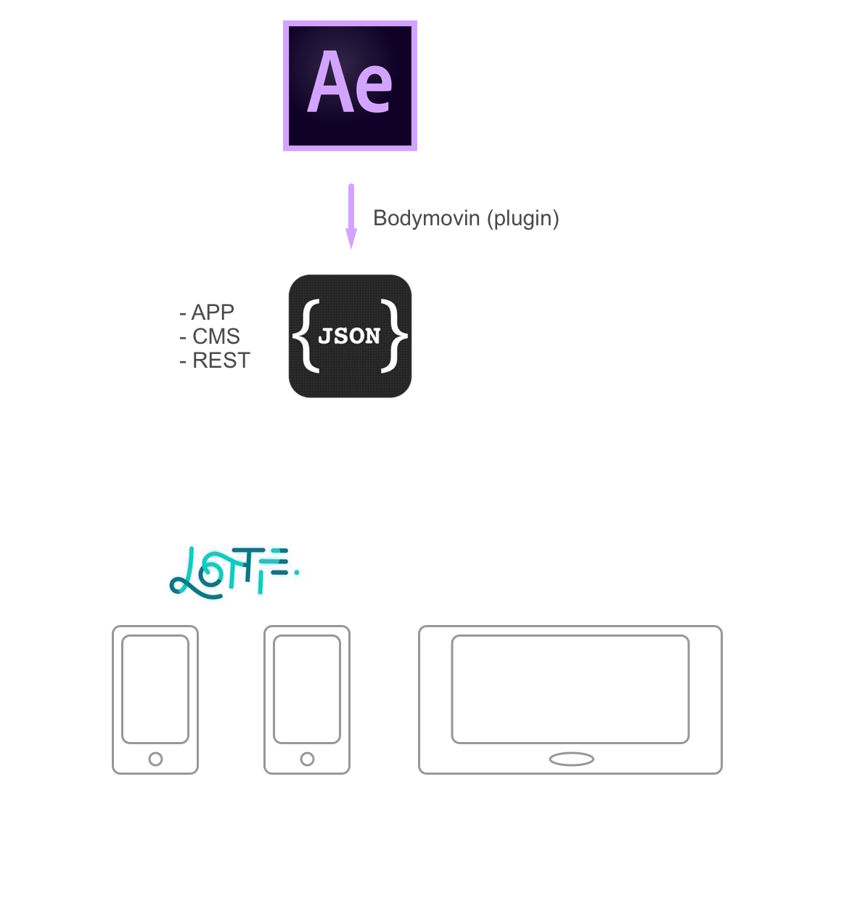

# After Effects + Bodymovin + Lottie

Animasjon på alle plattformer

---

### Hvem er vi? Hva gjorde vi?

- Alexander Schipper (designer)
- Eivind Wikheim (utvikler)
- Karl Stenersen (utvikler)

---

Hvem har tatt dette i bruk?

---

### Workflow

- Animere i After Effects
    + Bodymovin eksportere JSON-fil
- Eksponere JSON-fil via rest-api
- Applikasjoner (web og native) kan importere JSON og vise animasjon

---

### Litt kode

´´´xml
<com.airbnb.lottie.LottieAnimationView
    xmlns:app="http://schemas.android.com/apk/res-auto"
    android:id="@+id/animation_view"
    android:layout_width="wrap_content"
    android:layout_height="90dp"
    android:layout_marginTop="20dp"
    android:layout_centerHorizontal="true"
    app:lottie_fileName="paraply.json"
    android:layout_below="@id/pin_input_field_layout"
    app:lottie_loop="true"/>
´´´

---
### Litt kode

´´´
const params = {
    container: document.getElementById('bodymovin-umbrella'),
    renderer: 'svg',
    loop: 2,
    autoplay: true,
    animationData: json
};
bodymovin.loadAnimation(params);

---?image=./img/test.png

---

# DEMO
